# 物流管理小程序(文末免费领取☟)
> 
#### 介绍
物流管理小程序(Java_SpringBoot_微信小程序)
有BUG可留言加微

#### 软件架构
Java + SpringBoot + 微信小程序 + Mybatis + Mysql

#### 项目功能说明

> + 系统分为管理员、员工、用户三种角色
> + 登录注册
> + 管理员管理、员工管理、用户角色管理
> + 部门管理
> + 物品分类管理
> + 物流公司管理
> + 物流信息管理
> + 配送信息管理
> + 运输信息管理
> + 装卸搬运管理
> + 仓储信息管理
> + 收货信息管理
> + 系统管理：关于我们、系统简介、轮播图管理、物流资讯

### 部分功能演示

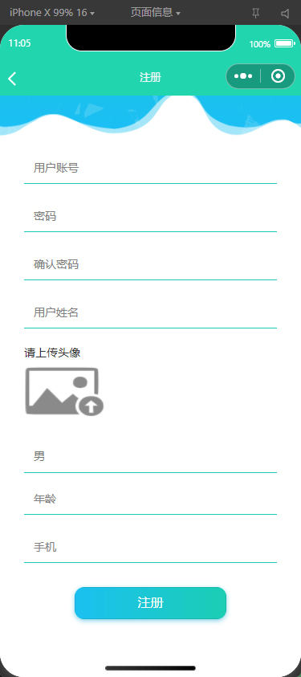

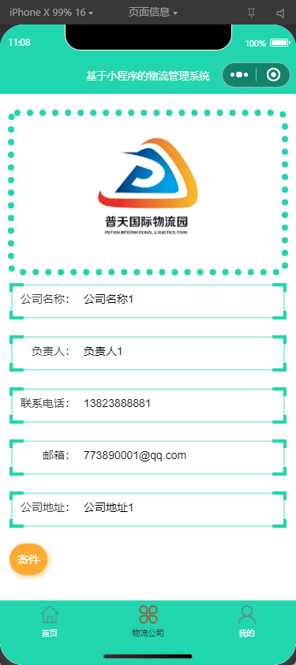
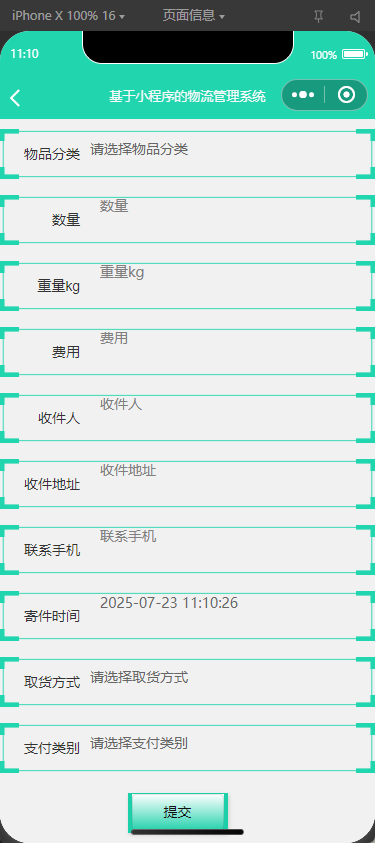
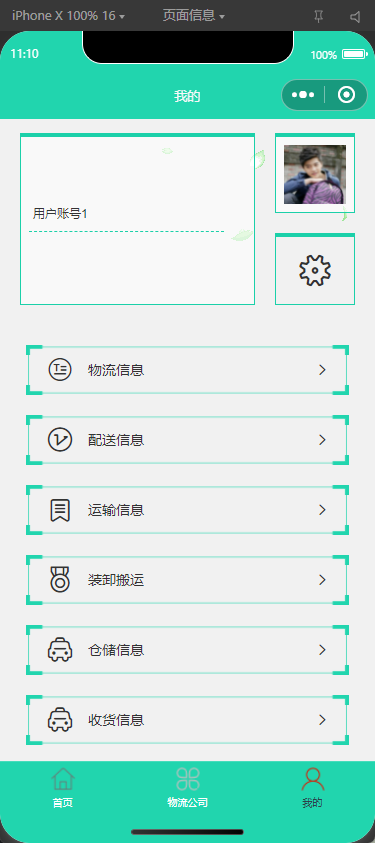
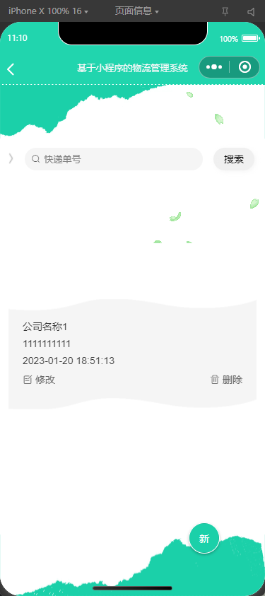
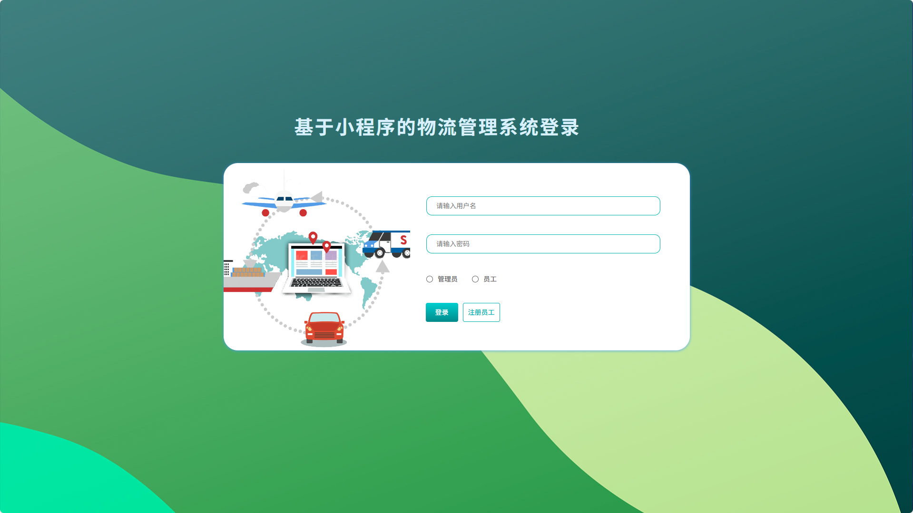
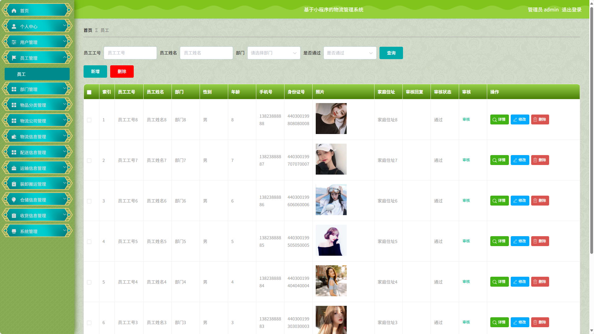
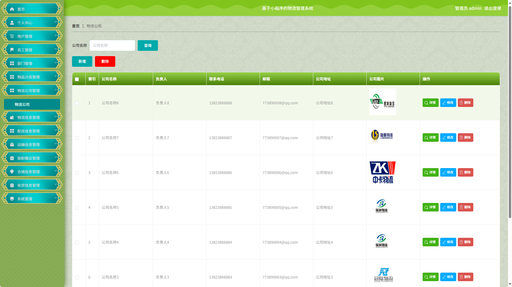
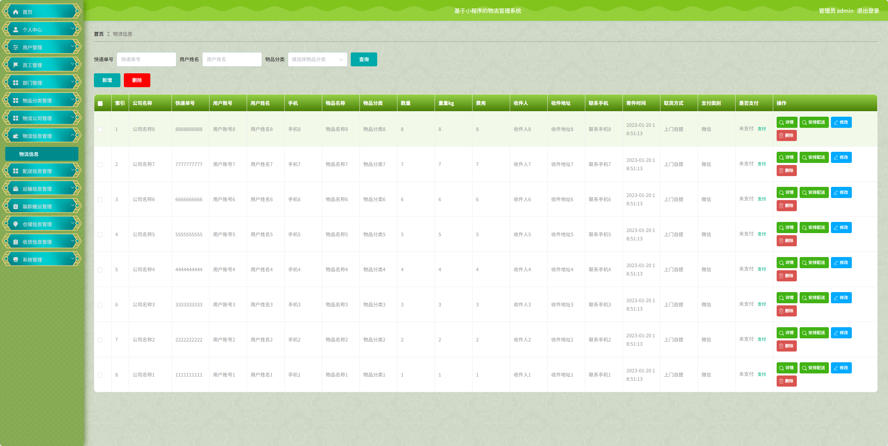
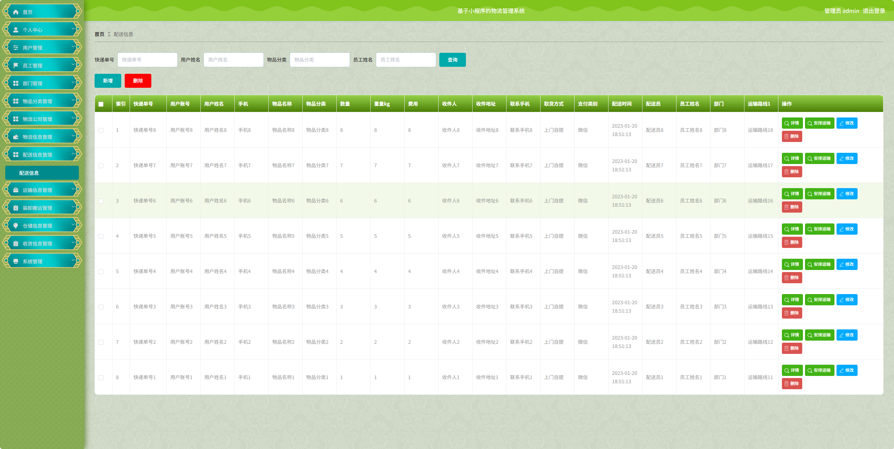
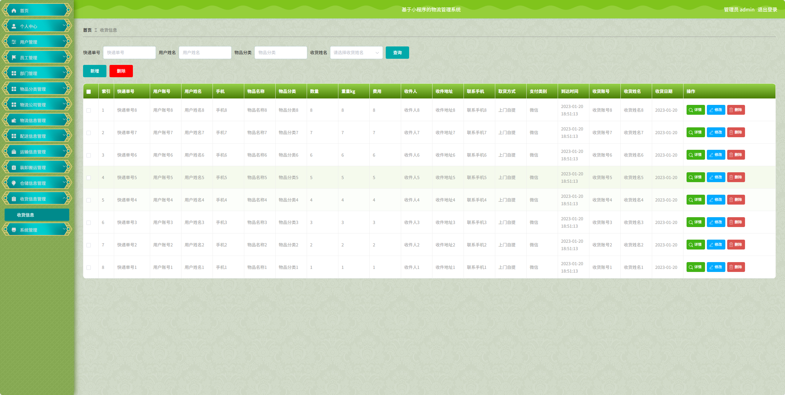
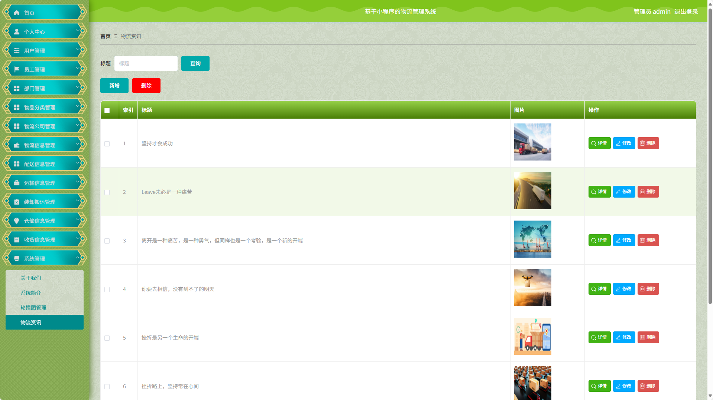

### 环境需求(可免费提供)
- idea/eclipse、jdk-1.8、maven-3.8.6、mysql、node.js等

## 有项目修改、安装调试需求 请联系以下

## 获取资源扫☝☝☝

